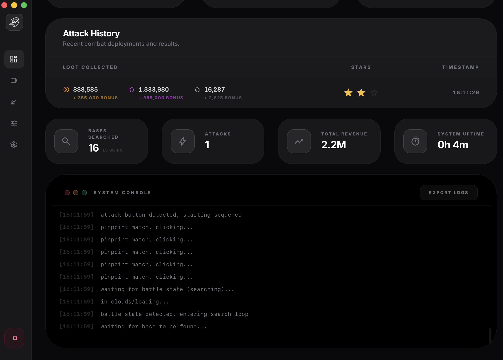

# ClashGO ⚔️

This is **ClashGO**, a super lightweight, high-performance Clash of Clans bot written in Go. 

### Why I made this
I just wanted a bot that actually worked on my Mac. I tried using the original [MyBot.run](https://github.com/MyBotRun/MyBot) but it's built for Windows and uses AutoIt, which didn't really vibe with my setup. So, I spent 3 days vibe-coding this Go version from scratch. It's a bit rough around the edges, but it's fast, efficient, and gets the job done.



---

## 🚀 Performance & Why Go

I chose Go because I wanted this to be as lightweight as possible while still being super fast.

- **Persistent ADB Transport**: Most bots spawn a new process for every single ADB command. ClashGO keeps a persistent TCP connection open to the ADB server, which is way faster and uses less resources.
- **Screencaps in < 120ms**: Because of the persistent connection, we can grab screenshots and process them almost instantly.
- **Low Overhead**: Being a compiled language, it runs as a single binary with zero dependencies. No bulky runtime needed.

---

## 🛠️ Setup & Configuration

### Running the Release (No Setup Needed)
If you just want to run the bot, download the latest release DMG. It's **fully standalone**—you don't need to install Go, OpenCV, or anything else. Just drag the app to your Applications folder and you're good to go.

---

## 🛠️ Development Setup
If you want to build from source or contribute, follow these steps:

### 1. Requirements
- **Go 1.25+**: [Download here](https://go.dev/doc/install).
- **OpenCV 4.x**: Used for the vision engine.
  ```bash
  brew install opencv pkg-config
  ```
- **ADB**: Make sure you have `adb` installed and your emulator is connected.

### 2. Emulator Settings
For the best results, set your emulator to:
- **Resolution**: 860x732
- **DPI**: 160

### 3. Config.json
The bot uses a `config.json` to manage your settings. You'll need to point it to your ADB device.

```json
{
  "device": {
    "adb_host": "127.0.0.1",
    "adb_port": 5037,
    "device_id": "localhost:5555"
  },
  "training": {
    "enabled": true,
    "full_army_before_attack": true
  },
  "attack": {
    "enabled": true,
    "strategy_file": "assets/strategies/auto_edrag_rush.yaml"
  }
}
```

---

## 💂 Armies & Training

ClashGO handles army training automatically using the game's **Quick Train** system.

### How to use it:
1. Open the Training menu in CoC.
2. Save your preferred army to one of the **Quick Train** slots.
3. The bot will automatically detect when your army is empty and use that slot to refill it.

### Custom Strategies
You can swap between different attack strategies by changing the `strategy_file` in your `config.json`. These are stored as `.yaml` files in `assets/strategies/`.

---

## ❤️ Contributing & Improvements

This project is open-source because I want everyone to be able to use it, modify it, and help make it better. Since this was mostly built in a 3-day sprint, there's definitely room for upgrades.

If you want to help out:
- If you find a bug, open an **Issue**.
- If you have an improvement or a new feature, send a **Pull Request**. 

---

## 🏃 Running the Bot

### CLI Mode (Headless)
```bash
go build -tags cli -o clashgo .
./clashgo
```

### GUI Mode (Desktop)
```bash
wails dev
```

### Building for Release
```bash
make release
```
The DMG will be in `build/bin/ClashGO.dmg`.

---

## 📄 License
Switched to the **MIT License**. Use it, change it, do whatever you want. 
